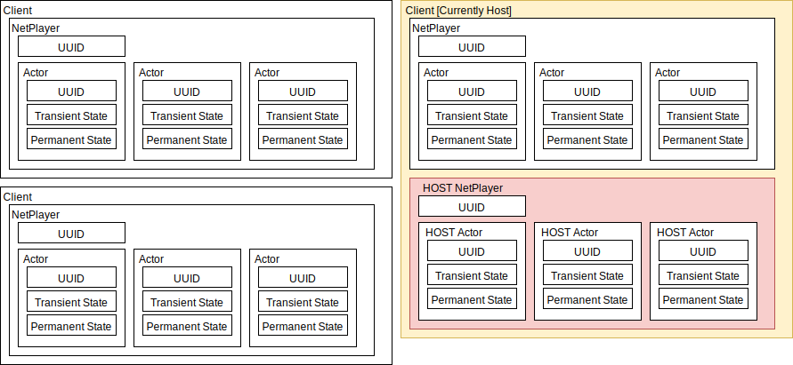

# ReActorNet Documentation

## Networking Framework Overview

### Room Based Networking

ReActorNet, like UNet, RakNet, Photon, and Socket.IO is a room-based networking solution.

That means that there is a master registry of what are called "Rooms" that players can join. Rooms are like isolated sessions of the game -- messages cannot travel outside the rooms they are generated in, are sent only to players in that same room, and a connected client cannot send messages unless they are inside one of these rooms.

Some games will allow players to create their own rooms or pick from a master list of rooms to join. Other games handle room creation and connection automatically. (This is called Matchmaking).

Unfortunately, the interfaces available for room management and matchmaking are incredibly diverse, and differ greatly in very fundamental ways between networking frameworks.

As a result, because ReActorNet aims to offer maximal flexibility, while still being agnostic to underlyiung network framework, ReActorNet does not provide a universal interface to matchmaking. If your project is switching to a new underlying framework, it is far better practice to write a new lobby / matchmaking system from scratch that matches well with the new framework.

That being said, once inside a room, ReActorNet\'s interfaces are completely underlying framework agnostic. So the bulk of your networking code is transferrable between interfaced frameworks without modification.

Rooms typically have a Host who has special powers and responsibilities. For instance, if a game allows the creator of a room to kick its players, these are Host powers. If a game requires scorekeeping and win-state detection that would be pointless or problematic to have occuring on multiple clients simultaneously, then this would be a Host responsibility.

### Actor-Based Networking

There exist two commonly used styles of networking frameworks in the game development sphere: Actor-Based networking, and event-based networking.

Where event-based frameworks simply route messages to other all other connected clients, or, if lucky, specific connected users, actor-based frameworks have a builtin notion of an "Actor" and allow messages to be directed straight from actors on one client, to the representative of that actor on any other client.

ReActorNet, RakNet, UNet, and Photon are examples of actor-based networking.

Socket-IO, and Photon (again?!) are examples of event-based networking.

Photon appears on both lists because it provides an underlying "pure" event-based interface, which multiplayer projects are free to use. In fact, a project implemented on Photon need never use Photon's actor system (called PhotonViews) at all, and can develop games much more in the style of Socket.IO

In fact, all actor-based networking frameworks are technically event-based under the hood, simply including UUID prefixes to make sure events are routed to the correct actors, and providing builtin events for actor creation. This is how both Photon and ReActorNet work under the hood.

ReActorNet is an actor-based networking framework, and it "should not" be built on top of networking systems that have their own actor system. We bend this rule slightly by taking advantage of Photon\'s event-based-only features.

That being said, if you are desperate to interface ReActorNet with a networking framework that has its own actor system, go ahead, but take care to check if the framework provides pure event-based networking like Photon (PhotonNetwork.RaiseEvent is A-OK, but PhotonView.RPC is a no-no)!

If no such interface exists, you will be forced to allocate a single static actor in whatever framework you have, and use that to relay all messages, causing a static overhead for all messages, and possibly causing superfluous double-transmission when using interest groups if client-targeted RPCs are not possible.

### What is an actor?

If you are famiar with RakNet\'s and UNet\'s NetworkViews, or Photon\s PhotonView, then you know roughly what an actor is.

Actors are a special type of object (Think OOP Object, not GameObject) that, when allocated, is allocated simultaneously on multiple (typically all) machines in the connected room.

Typically, actors provide builtin methods to synchronize state information (such as a position vector, a health float, or a team integer), and send events to all copies of the actor on all clients (such as when a player is hurt)

In most Unity-based networking systems, actors are tied irremediably to Unity's GameObject system. This is great for simple projects, but can get in the way of more complicated endeavors where a developer may wish not to have to allocate GameObjects solely as headless networked entities.

## ReActorNet\'s exact structural breakdown

ReActorNet can be broken down into several layers. The root layer is the Session (synonymous with Room). When a player starts a room and begins playing, this constitutes a Session. When other players join the room, they are joining that Session.

Sessions, thus, contain multiple Clients. Each Client is an instance of your game.

Each Client can contain multiple Network Players. Typically, there is one Network Player per client, however a developer may implement bots in the form of Bot NetworkPlayers, and there is a special type of NetworkPlayer known as the Host NetworkPlayer that the current host Client always owns.

Bot NetworkPlayers, Host NetworkPlayers, and normal NetworkPlayers are identical except for their behavior when their owning client disconnects. When the owner of a Host NetworkPlayer disconnects, the NetworkPlayers is automatically transferred to the new host client. When the owner of a Bot NetworkPlayer disconnects, the Bot NetworkPlayer is automatically transferred to whichever client currently owns the least number of bots. When the owner of a normal disconnects NetworkPlayer, the NetworkPlayer is not transferred.

The Host NetworkPlayer exists to own and preserve special actors responsible for tasks such as scorekeeping, win-state detection, management of room settings, etc. For example, the classic "GameManager" PhotonView found in many multiplayer games.

A NetworkPlayer may at any point request to transfer its ownership to a new client, or the ownership of any of its actors to any other NetworkPlayer.

All NetworkPlayers, and all of their actors, contain a UUID that is used to address them and keep them synchronized across network. Users of ReActorNet may raise events directly on NetPlayers or on Actors.

All NetworkPlayers, and all of their actors, contain a special dictionary of data known as Non-Transient State. This state is automatically synchronized across all clients, and is cross-referenced during NetworkPlayer ownership transfers.

# Synchronization Pathways

There are four distinct methods for NetworkPlayers and actors to communicate. They are as follows:

## Non-Transient State

I have already mentioned this communication pathway. All NetworkPlayers and Actors contain a string-indexed, anonymous-typed dictionary that any client can modify. Changes to this dictionary are buffered and sent en masse at a regular rate, every 0.1S by default. Please note that if two actors modify the same register within a short amount of time, these modifications may be execute in the wrong order on different clients. Either follow very strict property ownership, or perform only commutative operations (namely addition and multiplication for numeric types, or inversion for boolean types).

## Transient State

Transient state synchronization is a very special feature of ReActorNet. This is very similar to typical object synchronization, such as that found in Photon's OnPhotonSerializeView(), except for one very key feature: **ReActorNet actors have the ability to transmit state updates at different rates to different clients, saving massively on bandwidth in rooms with large numbers of players**

Each NetworkPlayer has, associated with it, a list of actors that I refer to as an Interest Group. Actors will send their synchronization data more often to NetworkPlayers whose interest groups they are a part of, while sending their data less often to NetworkPlayers whose groups they are not a part of.

This is accomplished via a process called "empathetic load balancing." In fact, these interest groups are never transmitted, but are calculated locally at the beginning of every frame by every client. You will be required to write a small class that handles empathetic load balancing in such a way that (roughly) the same results are arrived at by all clients for all of the interest groups.

As an example, a simple procedure might be to put actors that are within a certain distance of a given NetworkPlayer's main character actor on that NetworkPlayer's interest group. There may be brief incongruence between the results each client arrives at for a particular NetworkPlayer's interest group during times when an actor is right on the edge of the threshold radius, for instance, but in general the results should be similar enough that total message transmission does not stray far from the budget.

Once these interest groups are generated, ReActorNet will assign two data rates to each actor (the interested and disinterested data rates) based on the given transient state budgets, and a total transient state budget may be set.

***EXACT METHOD FOR DETERMINING RATES TBD***

The actor is then asked to produce status updates either for all interested parties, or for every one else. These requests for updates are made, and their results are sent, at the calculated interested and disinterested rates.

## Reliable Messages

Messages can be sent either as Reliable Messages, or Transient Messages.

Reliable messages are always sent to all clients, and every NetworkPlayer keeps a list of all messages received. Whenever a NetworkPlayer's ownership is transferred, the message tables held by each client for the NetworkPlayer are compared against the message table of the receiving client, and any messages which the receiving client had not processed for that NetworkPlayer are marked for reprocessing by all other clients, after the non-transient state for those clients' copies of the NetworkPlayer and its actor are synchronized to the receiving NetworkPlayer's copy. Messages that ***have*** been processed by the time of the non-transient state transfer are marked as processed, even if other clients actually haven't processed them.

To simplify, the general idea during an ownership transfer is to take whatever the perspective of the receiving client as the word of god, and make sure that all other clients reflect this perspective. So, we copy the non-transient state to all other clients, and then re-process any messages that weren't processed by the receiving client, and we make sure that other clients don't process any messages who were processed by the receiving client before the non-transient state transfer.

The message tables will only go back a configurable amount of time (default: 10 seconds). Past this, messages are considered "fully sent," and special re-processing or process blocking is not necessary.

## Transient Messages

# Transfer & Connection Procedures

## Client Join Procedure

## Client Request Network Player Procedure

## NetworkPlayer Transfer Procedure

