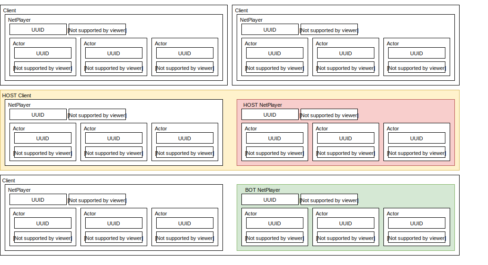

# ReActorNet Documentation

## Networking Framework Overview

### Room Based Networking

ReActorNet, like UNet, RakNet, Photon, and Socket.IO is a room-based networking solution.

That means that there is a master registry of what are called "Rooms" that players can join. Rooms are like isolated sessions of the game -- messages cannot travel outside the rooms they are generated in, are sent only to players in that same room, and a connected client cannot send messages unless they are inside one of these rooms.

Some games will allow players to create their own rooms or pick from a master list of rooms to join. Other games handle room creation and connection automatically. (This is called Matchmaking).

Unfortunately, the interfaces available for room management and matchmaking are incredibly diverse, and differ greatly in very fundamental ways between networking frameworks.

As a result, because ReActorNet aims to offer maximal flexibility, while still being agnostic to underlyiung network framework, ReActorNet does not provide a universal interface to matchmaking. If your project is switching to a new underlying framework, it is far better practice to write a new lobby / matchmaking system from scratch that matches well with the new framework.

That being said, once inside a room, ReActorNet\'s interfaces are completely underlying framework agnostic. So the bulk of your networking code is transferrable between interfaced frameworks without modification.

Rooms typically have a Host who has special powers and responsibilities. For instance, if a game allows the creator of a room to kick its players, these are Host powers. If a game requires scorekeeping and win-state detection that would be pointless or problematic to have occuring on multiple clients simultaneously, then this would be a Host responsibility.

### Actor-Based Networking

There exist two commonly used styles of networking frameworks in the game development sphere: Actor-Based networking, and event-based networking.

Where event-based frameworks simply route messages to other all other connected clients, or, if lucky, specific connected users, actor-based frameworks have a builtin notion of an "Actor" and allow messages to be directed straight from actors on one client, to the representative of that actor on any other client.

ReActorNet, RakNet, UNet, and Photon are examples of actor-based networking.

Socket-IO, and Photon (again?!) are examples of event-based networking.

Photon appears on both lists because it provides an underlying "pure" event-based interface, which multiplayer projects are free to use. In fact, a project implemented on Photon need never use Photon's actor system (called PhotonViews) at all, and can develop games much more in the style of Socket.IO

In fact, all actor-based networking frameworks are technically event-based under the hood, simply including UUID prefixes to make sure events are routed to the correct actors, and providing builtin events for actor creation. This is how both Photon and ReActorNet work under the hood.

ReActorNet is an actor-based networking framework, and it "should not" be built on top of networking systems that have their own actor system. We bend this rule slightly by taking advantage of Photon\'s event-based-only features.

That being said, if you are desperate to interface ReActorNet with a networking framework that has its own actor system, go ahead, but take care to check if the framework provides pure event-based networking like Photon (PhotonNetwork.RaiseEvent is A-OK, but PhotonView.RPC is a no-no)!

If no such interface exists, you will be forced to allocate a single static actor in whatever framework you have, and use that to relay all messages, causing a static overhead for all messages, and possibly causing superfluous double-transmission when using interest groups if client-targeted RPCs are not possible.

### What is an actor?

If you are famiar with RakNet\'s and UNet\'s NetworkViews, or Photon\s PhotonView, then you know roughly what an actor is.

Actors are a special type of object (Think OOP Object, not GameObject) that, when allocated, is allocated simultaneously on multiple (typically all) machines in the connected room.

Typically, actors provide builtin methods to synchronize state information (such as a position vector, a health float, or a team integer), and send events to all copies of the actor on all clients (such as when a player is hurt)

In most Unity-based networking systems, actors are tied irremediably to Unity's GameObject system. This is great for simple projects, but can get in the way of more complicated endeavors where a developer may wish not to have to allocate GameObjects solely as headless networked entities.

## ReActorNet\'s exact structural breakdown

ReActorNet can be broken down into several layers. The root layer is the Session (synonymous with Room). When a player starts a room and begins playing, this constitutes a Session. When other players join the room, they are joining that Session.

Sessions, thus, contain multiple Clients. Each Client is an instance of your game.

Each Client can contain multiple Network Players. Typically, there is one Network Player per client, but if a developer desires, they may implement bots as additional NetworkPlayers. The current Host client also has a special Host Network Player that (typically) owns only headless Actors whose job it is to handle Host powers and Host responsibilities. This includes scorekeeping, win-state detection, management of room settings, etc. 

The Host NetworkPlayer is treated differently to other NetworkPlayers by ReActorNet, in that it is transferred automatically during host transfer. This differs greatly from traditional actor-room-based frameworks, where actors will typically just check if they are currently owned by a host client.

All NetworkPlayers contain a UUID that is used to address them and keep them synchronized across network. Users of ReActorNet may raise events directly on NetPlayers.

All NetworkPlayers contain a special dictionary of data known as Non-Transient State